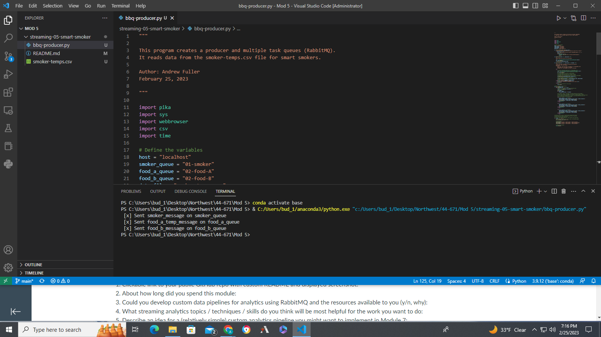

## Week 5: Smart Smoker Producer

> Using RabbitMQ create a producer to monitor data from the sensors of a bbq smoker, reading a value every 30 seconds.
* Smoker-temps.csv has 4 columns:
  * [0] Time = Date-time stamp for the sensor reading
  * [1] Channel1 = Smoker Temp --> send to message queue "01-smoker"
  * [2] Channel2 = Food A Temp --> send to message queue "02-food-A"
  * [3] Channel3 = Food B Temp --> send to message queue "03-food-B"
